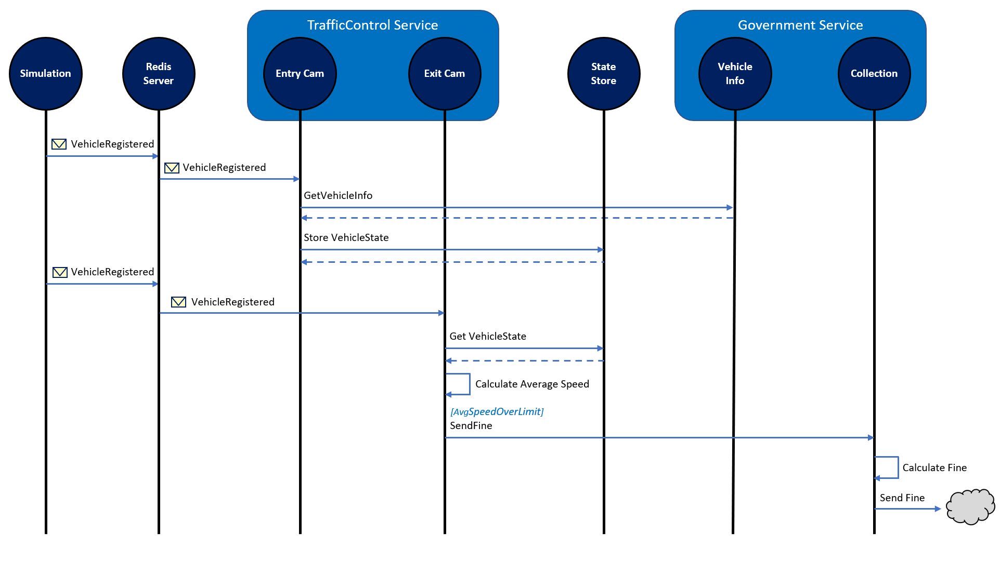
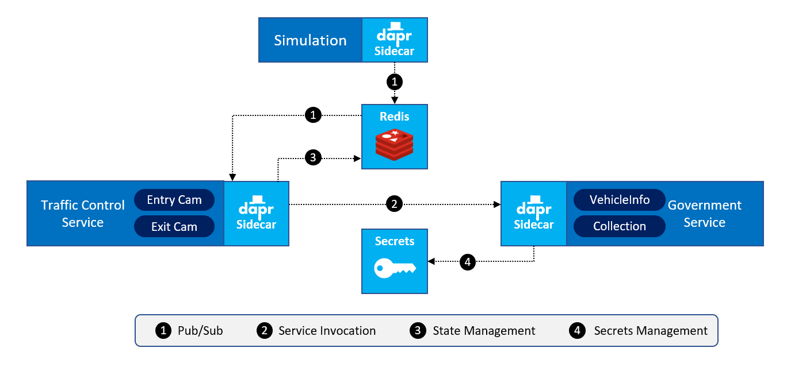

# Dapr 交通控制示例

| 组                  | 细节             |
| -------------------- | ------------------- |
| Dapr runtime version | v1.0.0-rc.3         |
| .NET SDK version     | v1.0.0-rc05         |
| Dapr CLI version     | v1.0.0-rc.4         |
| Language             | C# (.NET Core)      |
| Environment          | Local or Kubernetes |

此仓库包含一个示例应用程序，用于使用 Dapr 模拟流量控制系统。对于此示例，我们将使用超速摄像头装置，该装置可在多个荷兰高速公路上找到。在某条高速公路的整个长度上，将测量车辆的平均速度，如果该平均速度高于该高速公路上的超速极限，则该车辆的驾驶员会收到超速罚单。

## 概述
这是我在此示例中模拟的虚构设置的概述:


每个泳道有1个进入相机和1个离开相机。当汽车通过入口摄像机时，将注册该汽车的车牌号。

在后台，通过调用汽车部门的Dvd服务（DMV（或荷兰语中的RDW））获取有关车辆的信息。

当汽车通过出口摄像机时，系统会对其进行记录。然后，系统根据进出时间戳记计算汽车的平均速度。如果检测到超速违规，则会向中央司法征收机构发送一条消息-CJCA（或荷兰语中的CJIB）会将超速罚单发送给车辆驾驶员。

## 模拟
为了在代码中进行模拟，可以使用以下服务:


-  **Simulation** 是一个 .NET Core 控制台程序模拟过路车.
-  **TrafficControlService** 是一个ASP.NET Core的WebAPI的应用程序，提供2个端点: *Entrycam* 和 *ExitCam*.
-  **Government** 服务是一个ASP.NET Core的WebAPI的应用程序，提供2个端点：*RDW*（检索车辆信息）和*CJIB*（用于发送超速罚单） 

下面的序列图描述了仿真的工作方式：




1.  **Simulation** 模拟生成汽车车牌号并发送一个消息 *VehicleRegistered*  (包含汽车车牌号, 一个随机的泳道 (1-3) 和时间戳) 到服务 **TrafficControlService** 的端点 *EntryCam* .
2.  **TrafficControlService** 调用 **GovernmentService** 服务的 *RDW* 的端点  检索对应的汽车号牌车辆的品牌和型号
3.  **TrafficControlService** 在 state-store 里 存储VehicleState (车辆信息和进入时间戳) .
4. 一些随机间隔之后，  **Simulation** 发送 *VehicleRegistered* 消息到 **TrafficControlService** 服务的端点  *ExitCam* (含有在步骤1中产生的汽车号牌，随机出口车道（1-3）和出口时间戳).
5.  **TrafficControlService** 从state-store中获取 VehicleState .
6.  **TrafficControlService**使用 进入和出去的时间戳 计算平均速度.
7.  如果平均速度高于速度极限时,  **TrafficControlService** 将发送 *SpeedingViolationDetected* 消息 (包含车辆的车票，路面的标识符，高速化违反KMH和违规的时间戳) 到  **GovernmentService** 的端点 *CJIB* .
8.  **GovernmentService** 计算超速违章罚款和模拟发送超速票给车主

在执行过程中，此序列中描述的所有操作都会记录到控制台，因此您可以按照流程进行操作。

## Dapr

此示例使用 Dapr 实现应用程序的多个方面。在下面的图中，看到的是架构概述



1. 对于通信消息, 使用 **发布和订阅** 构建块来实现. 
2. 对于 request/response 型的服务通信 ，使用 **服务到服务调用** 构建块来实现. 
3. 对于车辆状态的存储，使用 **状态管理** 构建块来实现. 
4. 服务GovernmentService 中的 `VehicleInfoController` 有一个操作 `GetVehicleInfo` 使用`VehicleInfoRepository` 获取车辆数据. 这个 repository 的构造函数需要一个连接字符串作为参数。 这个连接字符串存储在一个secrets 文件里。 服务 GovernmentService 使用 **secrets management** 构建块带一个本地文件组件来获取连接字符串.

在这个例子里, Redis 组件既用于状态管理，又用于 pub/sub.

## 使用 Dapr 的 self-hosted 模式运行示例

执行以下步骤以在自托管模式下运行示例应用程序：

1. 确保你已经在你的计算机上 安装Dapr的 self-hosted 模式，具体参考文档 [Dapr documentation](https://docs.dapr.io/getting-started/install-dapr/).

2. 打开三个独立的命令行窗口.

3. 在第一个命令行Shell， 切换当前路径到 仓库 的 *src/GovernmentService* 文件夹 执行下面的命令行（使用Dapr CLI）运行 **GovernmentService**:

    ```
    dapr run --app-id governmentservice --app-port 6000 --dapr-grpc-port 50002 --config ../dapr/config/config.yaml --components-path ../dapr/components dotnet run
    ```

4. 在第二个命令行Shell, 切换当前路径到仓库的 *src/TrafficControlService* 文件夹 执行下面的命令（使用Dapr CLI） **TrafficControlService**:

    ```
    dapr run --app-id trafficcontrolservice --app-port 5000 --dapr-grpc-port 50001 --config ../dapr/config/config.yaml --components-path ../dapr/components dotnet run
    ```

5. 在第三个命令行Shell, 切换当前路径到仓库的 *src/Simulation* 文件夹 执行下面的命令运行 **Simulation**:

    ```
    dapr run --app-id simulation --dapr-grpc-port 50003 --config ../dapr/config/config.yaml --components-path ../dapr/components dotnet run
    ```

现在，您应该会看到每个 shell 中的日志记录，类似于如下所示的日志记录:

**Simulation:**  


**TrafficControlService:**  


**GovernmentService:**  


## Running the sample on Kubernetes
Execute the following steps to run the sample application on Kubernetes:

First you need to build the Docker images for the three services:

1. Open a command-shell.

2. Change the current folder to the *src/GovernmentService* folder of this repo.

3. Build the Docker image:

    ```
    docker build -t dapr-trafficcontrol/governmentservice:1.0 .
    ```

4. Change the current folder to the *src/TrafficControlService* folder of this repo.

5. Build the Docker image:

    ```
    docker build -t dapr-trafficcontrol/trafficcontrolservice:1.0 .
    ```

6. Change the current folder to the *src/Simulation* folder of this repo.

7. Build the Docker image:

    ```
    docker build -t dapr-trafficcontrol/simulation:1.0 .
    ```

> You can also use the `src/k8s/build-docker-images.ps1` script to build all the images.

Now you're ready to run the application on Kubernetes:

1. Make sure you have installed Dapr on your machine on a Kubernetes cluster as described in the [Dapr documentation](https://docs.dapr.io/getting-started/install-dapr/).

2. Make sure you have built the Docker images for the 3 separate services so they are available on your machine.

3. Open a command-shell.

4. Change the current folder to the *src/k8s* folder of this repo.

5. Install Redis in your Kubernetes cluster by executing the `install-redis.ps1` script. This script will also create a namespace `dapr-trafficcontrol` and install Redis in that folder. 

8.  Execute the `start.ps1` script. All services will be created in the `dapr-trafficcontrol` namespace.

You can examine the logging for the 3 individual services in several different ways. Let's do it using the Docker CLI:

1. Find out the container Id of the services:

    ```
    docker ps
    ```

  > Make sure you pick the Id of a container running the .NET service and not the Dapr sidecar (the command will start with `/daprd`). If you do pick the Id of a dapr sidecar container, you can check out the Dapr logging emitted by the sidecar.

2. View the log for each of the services (replace the Id with the Id of one of your services):

    ```
    docker logs e2ed262f836e
    ```

To stop the application and remove everything from the Kubernetes cluster, execute the `stop.ps1` script.

## Disclaimer
The code in this repo is NOT production grade and lacks any automated testing. It is intentionally kept as simple as possible (KISS). Its primary purpose is demonstrating several Dapr concepts and not being a full fledged application that can be put into production as is.

The author can in no way be held liable for damage caused directly or indirectly by using this code.
